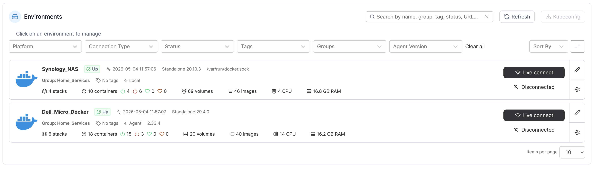
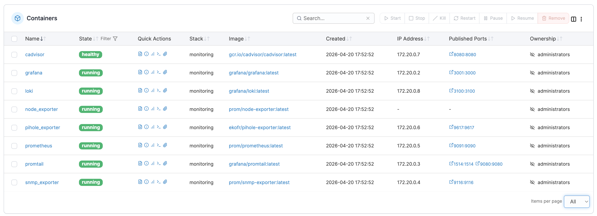
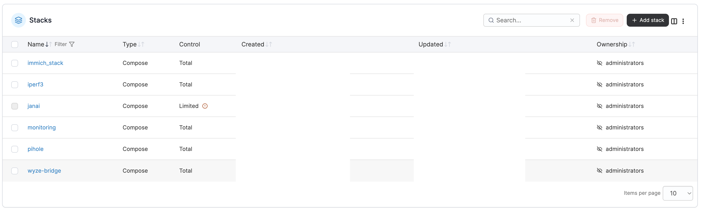

# Monitoring Stack

This section documents the monitoring and logging stack running on the Dell Micro Docker host. This stack was added as the homelab grew and I needed better visibility into system health, container performance, DNS behavior, logs, and network-adjacent services.

The goal of this setup is not just to have dashboards, but to create a more practical way to understand what is happening across the environment before something becomes a larger issue. As more services moved from the Synology to the Dell Micro, monitoring became a bigger priority because the Dell Micro became the main compute node for active Docker workloads.

---

## Why This Was Added

Early on, I was mostly running services and checking them manually when something felt wrong. As the environment expanded, that became harder to manage. I wanted a better way to answer basic operational questions:

- Are the containers running?
- Is the Docker host under load?
- Are CPU, memory, disk, or network resources becoming a bottleneck?
- Is Pi-hole responding and showing useful DNS metrics?
- Are logs being collected somewhere central?
- Can I eventually bring in network-device metrics as well?

This led to building a monitoring stack around Prometheus, Grafana, Loki, Promtail, and several exporters.

---

## Current Services

| Service | Purpose | Notes |
|---|---|---|
| Grafana | Dashboard and visualization layer | Published on host port `3001` because `3000` is already used by Open-WebUI. |
| Prometheus | Metrics collection and scraping | Published on host port `9091` because `9090` is already used by another host-level service. |
| Loki | Log storage backend | Stores logs collected by Promtail. |
| Promtail | Log shipper | Reads system/container logs and forwards them to Loki. Also exposes a syslog listener for future network logging. |
| cAdvisor | Docker container metrics | Tracks container CPU, memory, I/O, and runtime behavior. |
| Node Exporter | Linux host metrics | Uses host networking and host PID namespace to expose system-level metrics. |
| Pi-hole Exporter | Pi-hole metrics | Exposes Pi-hole statistics to Prometheus. |
| SNMP Exporter | Network device metrics | Added for experimenting with SNMP metrics from devices like DD-WRT and Synology. |

---

## Screenshots

> Note: Screenshots should be reviewed and redacted before publishing. Anything showing private hostnames, IPs, user accounts, tokens, passwords, family names, or internal-only details should be removed or blurred.

Recommended screenshot paths for this section:

```text
assets/screenshots/portainer-main-environments.png
assets/screenshots/portainer-dell-container-list.png
assets/screenshots/portainer-dell-monitoring-containers.png
assets/screenshots/portainer-dell-stacks-list.png
assets/screenshots/portainer-synology-container-list.png
assets/screenshots/portainer-synology-stacks-list.png
```

Example Markdown references:

```markdown





```

---

## Portainer Environment Overview

Portainer is used to manage Docker environments across both the Synology NAS and the Dell Micro. This gives me a cleaner way to view containers, stacks, images, volumes, and environment status from one interface.

The two main Docker environments are:

| Environment | Role |
|---|---|
| Synology NAS | Storage-oriented services, NAS-side containers, Home Assistant, iCloudPD, testing workloads. |
| Dell Micro Docker | Main Docker compute host for monitoring, Immich, Pi-hole, Open-WebUI/Ollama, and active service workloads. |

The Portainer overview is useful because it quickly shows the split between the two hosts. The Synology has fewer active containers and remains more storage-focused, while the Dell Micro carries more of the active Docker workload.

---

## Docker Compose / Portainer Stack

The monitoring stack is deployed as a Portainer Stack using a Docker Compose file. This was part of the larger shift away from running loose Compose files manually and toward managing services through Portainer Stacks.

This makes it easier to:

- View which services belong together.
- Update the stack from one place.
- Restart or inspect individual containers.
- Keep port mappings and volumes easier to review.
- Treat the monitoring stack as one managed unit instead of several unrelated containers.

Sanitized stack example:

```yaml
version: "3.8"

services:

  grafana:
    image: grafana/grafana:latest
    container_name: grafana
    ports:
      - "3001:3000"
    environment:
      GF_SECURITY_ADMIN_USER: "********"
      GF_SECURITY_ADMIN_PASSWORD: "********"
    volumes:
      - /srv/monitoring/grafana:/var/lib/grafana
    restart: unless-stopped

  node_exporter:
    image: prom/node-exporter:latest
    container_name: node_exporter
    network_mode: host
    pid: host
    restart: unless-stopped

  cadvisor:
    image: gcr.io/cadvisor/cadvisor:latest
    container_name: cadvisor
    ports:
      - "8080:8080"
    volumes:
      - /:/rootfs:ro
      - /var/run:/var/run:ro
      - /sys:/sys:ro
      - /var/lib/docker:/var/lib/docker:ro
    restart: unless-stopped

  pihole_exporter:
    image: ekofr/pihole-exporter:latest
    container_name: pihole_exporter
    environment:
      PIHOLE_HOSTNAME: "192.168.1.xxx"
      PIHOLE_PORT: "80"
      PIHOLE_PASSWORD: "********"
    ports:
      - "9617:9617"
    restart: unless-stopped

  loki:
    image: grafana/loki:latest
    container_name: loki
    command: -config.file=/etc/loki/local-config.yaml
    ports:
      - "3100:3100"
    volumes:
      - /srv/monitoring/loki:/loki
      - /srv/monitoring/loki-config/local-config.yaml:/etc/loki/local-config.yaml:ro
    restart: unless-stopped

  promtail:
    image: grafana/promtail:latest
    container_name: promtail
    command: -config.file=/etc/promtail/promtail-config.yml
    volumes:
      - /srv/monitoring/promtail/promtail-config.yml:/etc/promtail/promtail-config.yml:ro
      - /var/log:/var/log:ro
      - /var/lib/docker/containers:/var/lib/docker/containers:ro
      - /etc/localtime:/etc/localtime:ro
    ports:
      - "9080:9080"
      - "1514:1514/udp"
    restart: unless-stopped

  snmp_exporter:
    image: prom/snmp-exporter:latest
    container_name: snmp_exporter
    ports:
      - "9116:9116"
    volumes:
      - /srv/monitoring/snmp-exporter/snmp.yml:/etc/snmp_exporter/snmp.yml
    command:
      - "--config.file=/etc/snmp_exporter/snmp.yml"
    restart: unless-stopped

  prometheus:
    image: prom/prometheus:latest
    container_name: prometheus
    ports:
      - "9091:9090"
    volumes:
      - /srv/monitoring/prometheus/prometheus.yml:/etc/prometheus/prometheus.yml
    restart: unless-stopped
```

---

## Port Decisions

Several port mappings in this stack are intentional because the homelab already has other services using common defaults.

| Service | Host Port | Container Port | Reason |
|---|---:|---:|---|
| Grafana | `3001` | `3000` | Host port `3000` is already used by Open-WebUI. |
| Prometheus | `9091` | `9090` | Host port `9090` is already occupied by a host-level service. |
| Loki | `3100` | `3100` | Default Loki port. |
| Promtail | `9080` | `9080` | Promtail HTTP/metrics endpoint. |
| Promtail Syslog | `1514/udp` | `1514/udp` | Syslog listener for future network device logging. |
| cAdvisor | `8080` | `8080` | Container metrics endpoint. |
| Pi-hole Exporter | `9617` | `9617` | Pi-hole metrics endpoint for Prometheus. |
| SNMP Exporter | `9116` | `9116` | SNMP scrape endpoint. |

---

## Why Each Component Exists

### Grafana

Grafana is the visual layer for the monitoring stack. It is intended to provide dashboards for system health, Docker containers, Pi-hole metrics, and eventually network/SNMP data.

### Prometheus

Prometheus is the metrics database and scraper. It collects metrics from exporters and services so they can be queried and visualized in Grafana.

### Loki and Promtail

Loki and Promtail were added for log collection. Promtail reads host and container logs and forwards them to Loki, which provides a centralized log backend that can later be queried from Grafana.

### cAdvisor

cAdvisor gives visibility into Docker container behavior, including CPU, memory, and I/O usage. This is especially useful on the Dell Micro because it now runs most of the active Docker services.

### Node Exporter

Node Exporter exposes Linux host metrics from the Dell Micro. It helps track resource usage at the host level rather than only looking at individual containers.

### Pi-hole Exporter

The Pi-hole exporter connects DNS-level visibility into the broader monitoring system. Since Pi-hole is a key network service, monitoring it helps show whether DNS filtering and query handling are healthy.

### SNMP Exporter

SNMP Exporter was added for experimenting with network and NAS metrics. This has been useful for learning, but it also introduced some configuration challenges around SNMP modules and exporter configuration syntax.

---

## Issues Encountered

This stack had several real troubleshooting moments while being built and adjusted:

- Prometheus failed to start when the YAML configuration had formatting errors.
- Grafana could not use the default host port `3000` because Open-WebUI already used it.
- Prometheus could not use host port `9090` because another host-level service was already bound to that port.
- SNMP Exporter produced version/configuration warnings during testing.
- Bad configuration changes caused some containers to restart until the config was corrected.
- Monitoring experiments contributed to host-level inotify/watch warnings, which required additional investigation.

These issues are part of why the stack is worth documenting. The final configuration matters, but the troubleshooting process is where much of the practical learning happened.

---

## Lessons Learned

- Default ports are convenient until multiple services need the same ones.
- Monitoring stacks depend heavily on clean YAML and consistent volume paths.
- Managing related services as a Portainer Stack is easier than treating each container separately.
- Metrics and logs are more useful when they are planned together instead of added randomly.
- The Dell Micro is a better fit than the Synology for active monitoring workloads because it has more compute available and behaves like a standard Linux Docker host.
- Redacting screenshots and configs is part of the documentation process when publishing homelab work publicly.

---

## Future Improvements

- Add screenshots of Prometheus targets.
- Add Grafana dashboard screenshots with sensitive data removed.
- Add a simple architecture diagram showing metrics and log flow.
- Add Prometheus scrape configuration examples.
- Add Loki/Promtail configuration examples.
- Add notes for SNMP monitoring of DD-WRT and Synology.
- Create a troubleshooting entry for the Prometheus YAML error.
- Create a troubleshooting entry for Grafana/Prometheus port conflicts.

